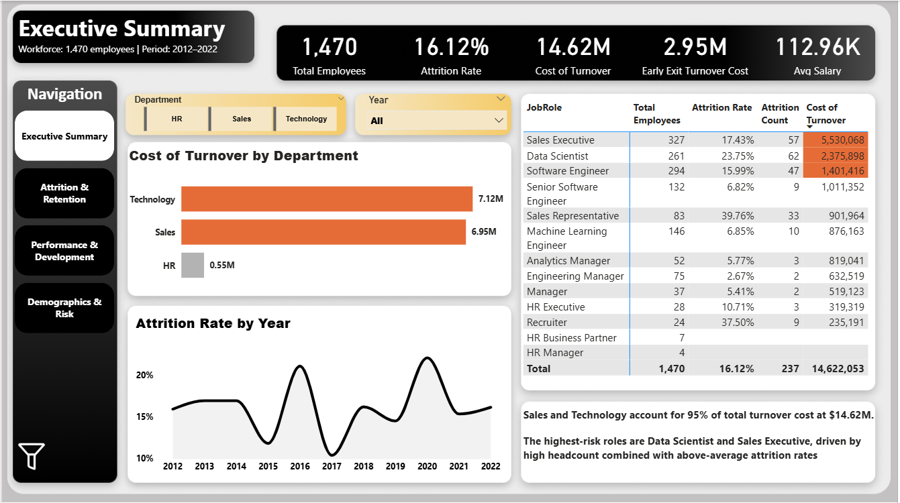
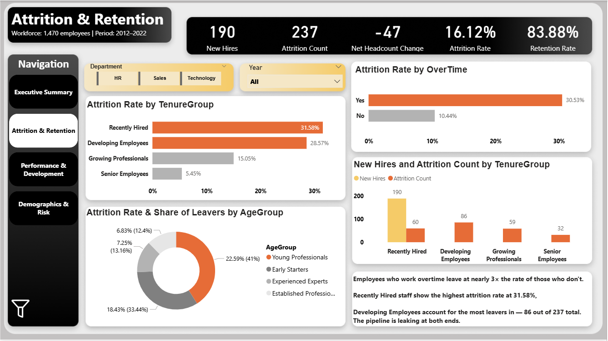
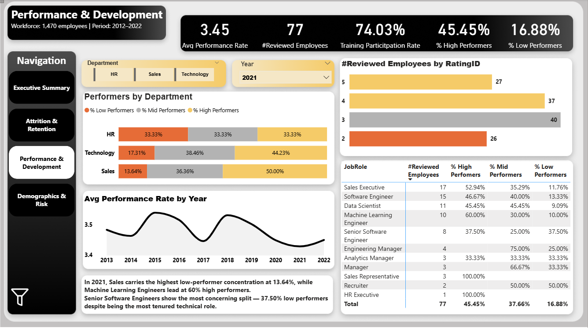
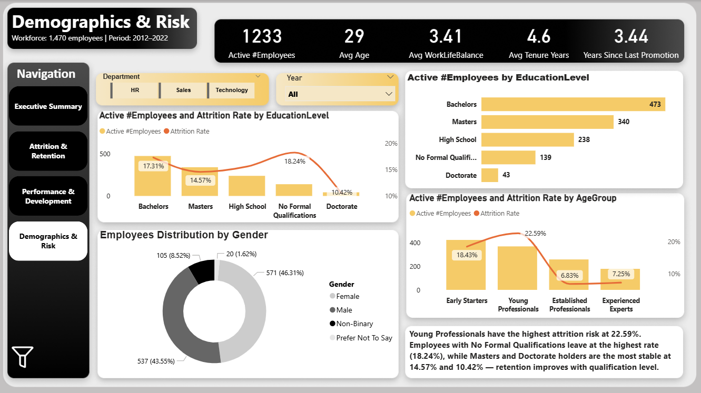
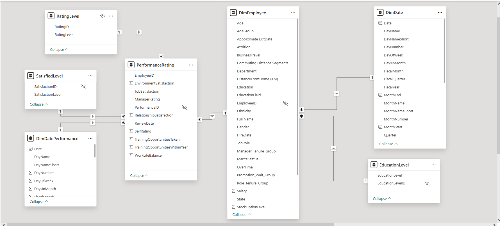

# HR Analytics Dashboard — Power BI

A 4-page Power BI dashboard built on a fictional HR dataset covering 1,470 employees across three departments (HR, Sales, Technology) from 2012 to 2022. The project was redesigned from scratch with a new design language and a stronger analytical narrative, using the same underlying data model.

## Dashboard 

---
## Preview



---

### Page 1 — Executive Summary
High-level financial and attrition overview for leadership.

**KPIs:** Total Employees · Attrition Rate · Cost of Turnover · Early Exit Turnover Cost · Avg Salary

**Key finding:** Sales and Technology account for 95% of total turnover cost ($14.07M of $14.62M). Data Scientists and Sales Executives are the highest-risk roles — high headcount combined with above-average attrition rates.

---

### Page 2 — Attrition & Retention

---
## Preview



---
Breaks down who is leaving, when, and why.

**KPIs:** New Hires · Attrition Count · Net Headcount Change · Attrition Rate · Retention Rate

**Key finding:** Overtime employees leave at nearly 3× the rate of non-overtime staff (30.53% vs 10.44%). Recently Hired employees show the highest attrition rate (31.58%), while Developing Employees account for the largest share of leavers by volume — 86 of 237 exits. The pipeline leaks at both ends.

---

### Page 3 — Performance & Development

---
## Preview

 

---
Performance distribution and training data, filtered to a single review year (default: 2021).

**KPIs:** Avg Performance Rate · Reviewed Employees · Training Participation Rate · % High Performers · % Low Performers

**Key finding:** Senior Software Engineers show the most concerning split — 37.50% low performers despite being the most tenured technical role. Machine Learning Engineers lead at 60% high performers.

> **Note:** The PerformanceRating table contains 6,709 rows (multiple annual reviews per employee). All performance visuals are interpreted at the single-year level. The year slicer defaults to 2021 as the most recent complete review year — setting it to All inflates all KPIs and should be avoided.

---

### Page 4 — Demographics & Risk

---
## Preview



---

Workforce composition and attrition risk by education and age.

**KPIs:** Active Employees · Avg Age · Avg Work-Life Balance · Avg Tenure · Years Since Last Promotion

**Key finding:** Attrition risk decreases consistently with education level — No Formal Qualifications: 18.24%, High School: 18.07%, Bachelors: 17.32%, Masters: 14.57%, Doctorate: 10.42%. Young Professionals carry the highest attrition rate at 22.59%.

---

## Data Model
---
## Preview



---
Star schema with two fact tables and five lookup/dimension tables:

| Table | Type | Description |
|---|---|---|
| DimEmployee | Dimension | Central table — all employee attributes |
| PerformanceRating | Fact | 6,709 rows — multiple annual reviews per employee |
| RatingLevel | Lookup | Performance rating labels |
| SatisfiedLevel | Lookup | Satisfaction rating labels |
| EducationLevel | Lookup | Education field labels |
| DimDate | Date | Hire and exit dates |
| DimDatePerformance | Date | Performance review dates (separate calendar) |

---

## Measures

Organized into 7 folders:

- **Attrition & Retention** — Attrition Count, Attrition Rate, Net Headcount Change, Retention Rate, # Attrition Last Year, Attrition YTD
- **Compensation & Rewards** — Avg Salary, Cost of Turnover, Early Exit Turnover Cost, Total Salary Expense
- **Employee Demographics** — Active #Employees, AvgAge, Department Headcount, Female %, Male %, New Hires, Total Employees, and range measures (Min/Max Age, Salary, HireDate)
- **Performance & Productivity** — #Reviewed Employees, % High/Mid/Low Performers, Avg Performance Rate
- **Satisfaction & Engagement** — Avg Job Satisfaction, Avg Relationship Satisfaction, Avg Work-Life Balance
- **Tenure & Experience** — Avg Tenure Years, Avg Years in Most Recent Role, Avg Years Since Last Promotion, Avg Years with Current Manager
- **Training & Development** — Avg Opportunities Taken, Avg Opportunities Within Year, Training Participation Rate

**Custom measure used in Page 3 matrix:**
```dax
Attrition Rate (All Years) = 
CALCULATE(
    [Attrition Rate],
    ALL(DimDate)
)
```
This prevents the year slicer from distorting the attrition rate column when comparing across tenure groups.

---

## Design

| Element | Value |
|---|---|
| Canvas | Cream/beige background |
| Header bar | Near-black (#1a1a1a), consistent across all pages |
| Accent color | Orange — highlights and high-risk indicators |
| Neutral bars | Warm grey |
| Navigation | Fixed left panel |
| Insight boxes | Bottom of every page — key takeaway in bold |

---

## Known Data Notes

- **HR Business Partner and HR Manager** — these roles show headcount only in the Page 1 matrix (7 and 4 employees respectively) with no attrition metrics. No recorded exits exist in the dataset for these roles.
- **PerformanceRating table** — 6,709 rows reflect multiple annual reviews per employee. Do not interpret performance KPIs at the All Years level.
- **$165K revenue reconciliation gap** — exists in the underlying dataset. Documented and accepted as a known discrepancy.

---

## Tools

- Power BI Desktop
- DAX
- Power Query
